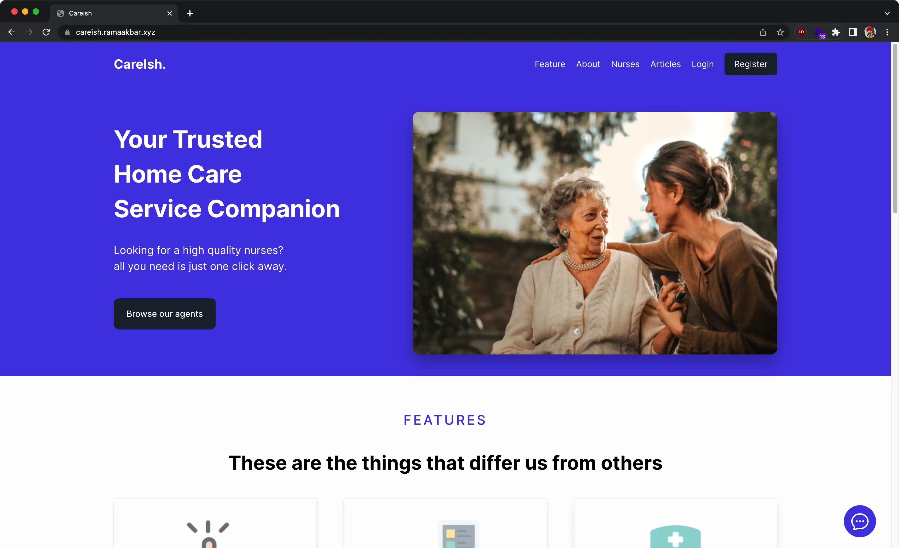
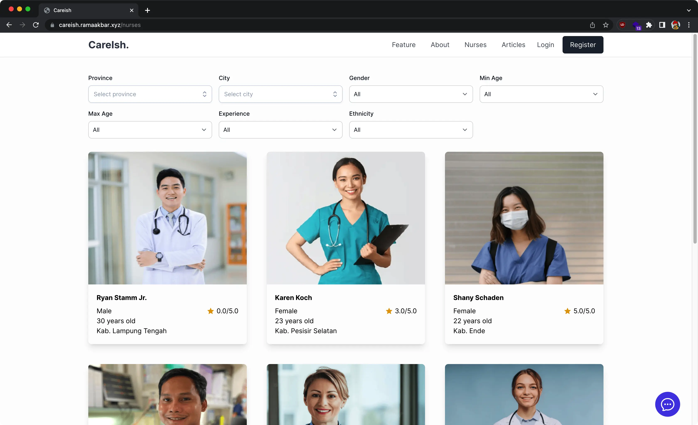
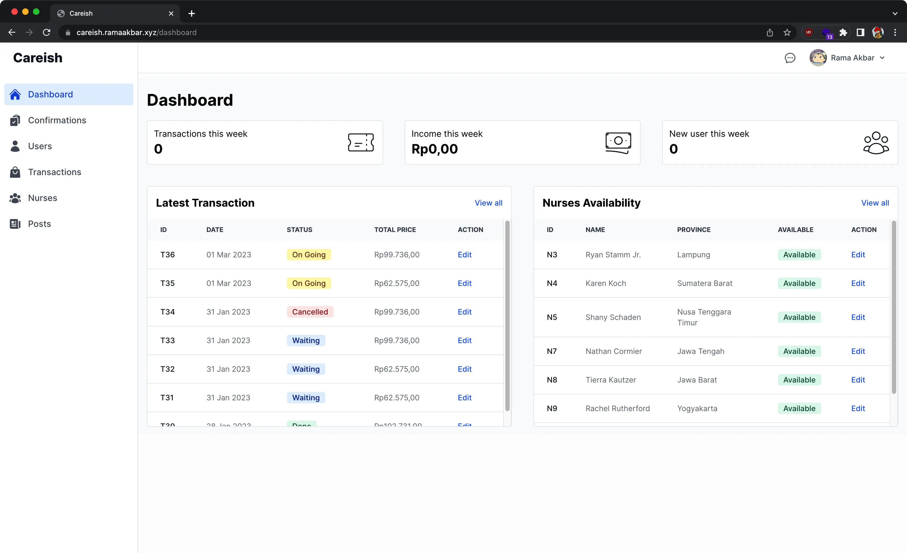

# CareIsh

**CareIsh** is a website-based application that can make the ordering and management of elderly nurse services easier for users and providers.

## Introduction

These days, the ordering process of elderly nurse services are done with traditional ways such as contacting the elderly service providers by phone or visiting the service directly. In order to make the ordering process and management of elderly nurse services easier for users and providers, a website-based application is developed to help. The development of this application used Laravel as its framework. Questionnaire, Interview, and literature study are used as the data collection method in this research.

The result of the research that has been conducted is a website based elderly nurse service providers app named **CareIsh**. With this application, the ordering process and management of elderly nurse services are much easier. It can be proved from the result of the interview of the elderly nurse service providers and questionnaire which states that 95.6% of respondent agree that the ordering process of elderly nurse services through website app is much easier.

## Team

-   [Akbar Ramadhan](https://github.com/ramaakbar)
-   [Patrick Thelysander](https://github.com/Osiris181)

## Tech Stack

-   [Laravel](https://laravel.com/)
-   [TailwindCSS](https://tailwindcss.com/) with [Flowbite](https://flowbite.com/)
-   [Livewire](https://laravel-livewire.com/)
-   [WireUi](https://livewire-wireui.com/)
-   [AlpineJS](https://alpinejs.dev/)
-   MySQL
-   Docker (see [coolify branch](https://github.com/ramaakbar/careish/tree/coolify) for dockerfile)

## Features

### User / Customer

-   Users can choose and book nursing services.
-   Users can filter their search for nurses.
-   Users can view detailed information about nurses.
-   Users can make transactions.
-   Users can give ratings and reviews for nurses they have previously booked.
-   Users can edit or delete their reviews.
-   Users can view all transactions they have made.
-   Users can change their name, email, password, and profile picture in the settings.
-   Users can add nurses to their favorites list and remove them.
-   Users can chat directly with the admin through the chat page.
-   Users can read and comment on articles.
-   Users can filter articles.

### Admin / Foundation

-   Admin can access Dashboard
-   Admin can add, edit, and delete nurses.
-   Admin can add, edit, and delete users.
-   Admin can edit and delete transactions.
-   Admin can add, edit, and delete articles.
-   Admin can accept, confirm, and complete nurse orders from users.
-   Admin can chat with multiple users directly through the chat page.

## Screenshots

-   Home Page
    

-   Nurses Page
    

-   Dashboard Page
    

## Demo Video

https://minio.ramaakbar.xyz/rmitiio/video%20demo%20CareIsh.mp4

## Deployment

Application deployed using docker and hosted on vps using [coolify](https://docs.coollabs.io/coolify/) for automatic redeployment on code push.

## Development Setup

The following tools are required in order for development setup.

-   PHP >=8.0
-   Composer
-   Node package manager (NPM, Yarn)
-   MySql Database

Steps to setup the app:

1. Clone the project

```bash
  git clone https://github.com/ramaakbar/careish.git
```

2. Go to the project directory

```bash
  cd careish
```

3. Install dependencies (composer and nodejs)

```bash
  composer install && npm install
```

4. Setup a local database called `careish`
5. Copy the `.env.example` file to `.env`

```bash
  cp .env.example .env
```

6. Generate a new app key with

```bash
  php artisan key:generate
```

7. Prepare database with migration and seeder

```bash
  php artisan migrate --seed
```

8. Start laravel server and run node

```bash
  php artisan serve
```

```bash
  npm run dev
```

Project will be running on http://127.0.0.1:8000. You can login in as admin with test@example.com & password.
